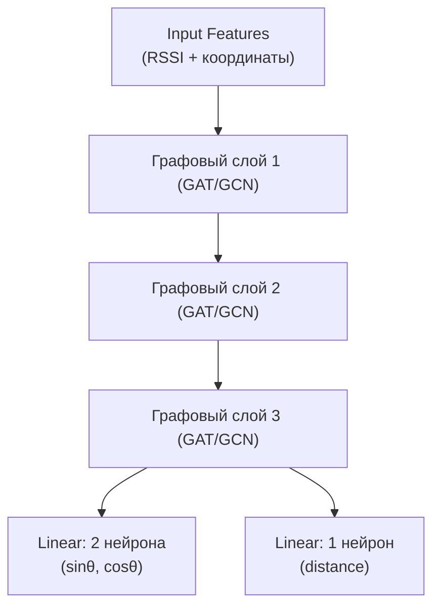

# Формат данных
    source_id { 
  
      features:
        [x_1, x_2, ..., x_n],  - координата точки измерения (широта)
        [y_1, y_2, ..., y_n],  - координата точки измерения (долгота)
        [rssi_1, rssi_2, ..., rssi_n] - сила сигнала в точке измерения
    
      targets:
        source_x,  - координата источника (широта)
        source_y,  - координата источника (долгота)
        [azimuth_1, azimuth_2, ..., azimuth_n] - направление к источнику из каждой точки измерения (угол от севера)
        [distance_1, distance_2, ..., distance_n] - расстояние от точки измерения до источника сигнала
    }

source_id представляет собой 1 тренеровочную запись. То есть имея на входе N измерений, мы для них должны получить N азимутов и расстояний и/или 1 координату источника. 
Нужно отметить, что по идее в обучающем наборе достаточно иметь лишь координаты источника, а азимуты и расстояния можно вычислить в рамках feature engineering

Модель должна научиться учитывать:
- Пространственную составляющую: как точки измерений расположены друг относительно друга, на каком расстоянии и с какой стороны
- Физическую (?) составляющую: меньшая rssi должна вносить меньший вклад в предсказание

# Предобработка данных

### Координаты

Все координаты первым делом должны пройти минмакс масштабирование в промежуток от 0 до 1, причем мин и макс координаты нужно задать заранее, чтобы определить рабочу область:

$$
x_{\text{norm}} = \frac{x - x_{\min}}{x_{\max} - x_{\min}}, \quad
y_{\text{norm}} = \frac{y - y_{\min}}{y_{\max} - y_{\min}}
$$

Даже не смотря на нормализацию, значения координат являются скорее категориальным признаком, меткой, уникальное количество которых зависит от точности числа. Проще говоря - для модели эти числа ничего не значат. В кажестве аналогии можно привести языковые модели - там для первичного кодирования каждого слова используется его индекс в алфавите, мощность которого тоже может быть достаточно большой. Для решения этой проблемы используют распределенные векторные представления (известные также как эмбеддинги), которые охватывают понятие сходства и семантического значения, позволяя сущности быть представленной шаблоном значений во многих измерениях. Word2Vec является наглядным примером такого преобразования. Для создания эмбеддинга координат можно воспользоваться такими методами как [Признаки Фурье для кодирования координат](https://sair.synerise.com/fourier-feature-encoding/) или [Пространсвтенное кодирование](https://machinelearningmastery.com/a-gentle-introduction-to-positional-encoding-in-transformer-models-part-1), которое применяется в трансформерах, и основано на признаках Фурье:

$$
\mathrm{PE}(x, i) = \sin\\bigl(x \cdot 10000^{-\tfrac{2i}{d}}\bigr), \quad
\mathrm{PE}(x, i+1) = \cos\\bigl(x \cdot 10000^{-\tfrac{2i}{d}}\bigr)
$$

где d — размерность эмбеддинга, i — индекс измерения.

Допустим если взять min = 0 и max = 10, и закодировать в этих пределах координату {5;7}, сначала она станет {0.5;0.7}, а потом 
          
    tensor[ 0.4794,  0.8776, -0.2624,  0.9650,  0.6442,  0.7648,  0.7739,  0.6333]

при размерности тензора = 8. Можно брать и больше, это по сути гиперпараметр.

### Сила сигнала (RSSI)

Данный параметр пока что единственное что характеризует расстояние до источника сигнала:

$$
P_d = P_0 - 10 \cdot n \cdot \lg\\bigl(\tfrac{d}{d_0}\bigr)
$$

Видно что по отношению к расстоянию данный параметр имеет логарифмическую зависимость. Можно было бы от нее избавиться во время нормализации, но я думаю что данную специфику лучше учесть при построении функции потерь либо физически информированного модуля сети. 
Так или иначе данный параметр необходимо нормализоватть в промежуток от 0 до 1. мин и макс параметры для RSSI будут -30 (отличный сигнал) и -120 (сигнал потерян). Эти границы могут разнитсья в зависимости от стандарта связи, но суть остается та же.

### Направление на источник

Так как азимут имеет циклическую природу (0° = 360°) необходимо использовать специальное кодирование, например через пару синус косинус:

$$
azimuth_{sin} = \sin\left( \frac{2 \pi \theta}{360} \right), \quad
azimuth_{cos} = \cos\left( \frac{2 \pi \theta}{360} \right)
$$

Это поможет устранить проблему цикличности и приведет значения в диапазон от -1 до 1.
Например Для 30° (северо-восток, 13 часов 30 минут): 

    sin(30°) = 0.5, cos(30°) ≈ 0.866.

### Расстояния до источника

Так как это обычный скаляр то значение просто нормализуется в промежуток от 0 до 1 в соответствии с граничными значениями рабочей области.

Однако данный признак можно использовать вместе с направлением (азимутом) посредством позиционного кодирования, чтобы сохранить пространыственную информацию. Посколько сила сигнала нелинейно зависит от расстояния, такое кодирование поможет модель выявить эту закономерность.
Например, для азимута 30° (северо-восток, 13 часов 30 минут) и расстояния 500 м и рабочей области от 0 до 1000:

    sin(30°) = 0.5, cos(30°) ≈ 0.866.

    500 м => 0.05

    tensor[0.5, 0.866, 0.0499, 0.9987, 0.0005, 0.9999]

По итогу получается датасет следующей структуры:

    | Features:
    | ├─ RSSI: (BATCH_SIZE, MEASUREMENT_COUNT, 1)
    | └─ Coordinates: (BATCH_SIZE, MEASUREMENT_COUNT, d)
    |
    | Targets:
    | ├─ Source Coords: (BATCH_SIZE, 1, d)
    | ├─ Azimuths: (BATCH_SIZE, MEASUREMENT_COUNT, 2)
    | ├─ Distances: (BATCH_SIZE, MEASUREMENT_COUNT, 1)
    | └─ Combined Vectors: (BATCH_SIZE, MEASUREMENT_COUNT, 2 + d)

Где BACTH_SIZE - размер выборки (количество source_id), MEASUREMENT_COUNT - количество точек измерений, d - размерность эмбеддинга для пространственного кодирования

# Цели обучения

Конечной и главной целью модели является предсказание точной координаты источника сигнала. Однако эту цель можно разбить на несколько подцелей:
1) Предсказания направления к источнику сигнала из каждой точки измерения. Пространственная характеристика, которая в большей степени зависит от от геометрии задачи, и в меньшей от RSSI (хватит простого в А больше чем в В)  
2) Предсказание расстояния от каждой точки измерения до источника сигнала. Данный параметр непосредственно связан с RSSI, который логарифмически зависит от расстояния до источника. На деле также зависит от среды распространения, но это скорее физическая поправка.
3) Усреднение направления и расстояния от всех точек измерения и нахождение координаты или области расположения источника.

**Отсюда могу построить предположение: На этапе предобучения модель должна с нуля научиться с какой-то точностью предсказывать шаги 1 и 2. Затем веса модели будут уточняться, вноситься поправки на физику распространения сигнала, и модель будет дообучаться до шага 3.**

# Выбор модели

Пока стоит состредоточиться на выборе модели для этапа предобучения. Решаемая задача по сути своей представляет обыкновенную регрессию, но так как данные имею пространственный характер, то на ум приходят CNN и GNN

### Сравнение CNN и GNN для предобучения (шаги 1 и 2)

| **Критерий**               | **CNN**                          | **GNN**                          |
|----------------------------|----------------------------------|-----------------------------------|
| **Обработка геометрии**     | (-) Требует преобразования данных в регулярную сетку (искажает произвольное расположение точек). | (+) Работает с исходными координатами, сохраняя пространственные отношения через граф. |
| **Учет физических законов** | (-) Зависит от ручных признаков (например, RSSI как функция расстояния). | (+) Явное моделирование через признаки ребер (расстояние, RSSI). |
| **Предсказание азимутов**   | (?) Локальные паттерны (только при регулярных точках). | (+) Точно вычисляет углы через геометрию графа. |
| **Предсказание расстояний** | (-) Сложность учета нелинейной зависимости RSSI. | (+) Интеграция формулы затухания сигнала через агрегацию в GNN. |
| **Масштабируемость**       | (?) Ограничено размером "изображения". | (+) Поддерживает переменное число точек. |

Помимо этого GNN будет занимать гораздо меньше памяти, поскольку ей нужно хранить лишь информацию о точках измерений и связях, а не весь фрагмент карты (сетку)

# Архитектура модели

Чтобы использовать GNN или её разновидности, первое, что необходимо сделать - это представить входные данные в виде графа. 

Вершинами графа будут выступать точки измерений, а ребрами - связи или отношения между точками измерений:

Здесь каждая вершина имеет несколько признаков, а именно силу сигнала в этой точке, а также координаты этой точки в пространстве. Это называется признаками вершин.
Связи между вершинами тоже могут иметь признаки, например расстояние между вершинами, а также относительно направление. Поскольку последний признак является направленным (если азимут из А в В равен Х, то азимут из В в А раввен Х + 180°), для его представления на графе между двумя вершинами можно провести 2 направленные связи (туда и обратно). Расстояние же представляется как ненаправленная связь. 
Если нормализовать все числовые признаки то получится следующее:

где синяя стрелка - направление от данного узла к соседнему, красная стрелка - обратное направление, а зеленая линия - расстояние между узлами.

Бесполезно, и даже вредно делать связи между всеми точками измерений, поэтому связи будут существовать с k ближайшими соседями для каждой вершины. Альтернативно можно создавать связи со всеми вершинами в заданном радиусе r. Стоит поэкспериментировать с этим, чтобы определить влиение наа предсказательную способность.

Подобно тому, как в полносвязной сети первый слой ожидает поулчить на вход вектор признаков, в GNN каждый узел или вершина ожидает получить на вход то же векторное представление. Это значит что необходимо закодировать все признаки в вектора. 

Векторное представление узла будет складыватсья из rssi и эмбеддинга координат:

        NODE [rssi, emb_x1, ..., emb_xn, emb_y1, ... emb_ym]

Векторное представление направленных ребер (направлений) будет складываться из синус косинусного кодирования азимута:

        D_EDGE [sin(azimuth), cos(azimuth)]

Векторное представление ненаправленного ребра (расстояние) будет складываться из ... 1-го числа

        UD_EDGE [distance]

В качестве альтернативы можно предложить 1 ненаправленную связь между вершинами и собрать векторное представление из всех признаков сразу:

        EDGE [distance, sin(azimuth), cos(azimuth), sin(azimuth + 180°), cos(azimuth + 180°)]

Сложно сходу сказать какое влияние это окажен на предсказательную способность, так что надо просто проверить...

Для распространения входного сигнала по GNN и превращения его в выходной используется механизм обмена сообщений, который для каждого узла определенно заданным образом агрегирует информацию от соседних узов и на этйо основе обновляет параметры данной вершины. 1 графовый слой позволяет для каждой вершины узнать инеформацию о своих соседях. Следующий слой уже сможет агрегировать соседей своих соседей, и так далее. Малое количество слоев будет слишком замкнуто на логальной структуре графа, а слишком большое наоборот смешает весь граф в одну кучу. Необходимо выбрать оптимальное количество слоев, которое будет приемлемо для характера распределения точек измерений. Например, если точек мало, но они довольно разрежены по рабочей обалсти, то нет необходимости создавать много слоев. Если же точек много, и они имеют честь сбиваться в кучу (ну чел встал в пробке или на светофоре) то может потребоваться большее количество слоев для агрегации более дальних (и по идее значимых) соседей. Думаю, это можно также регулировать и значением k или r, либо вовсе проводить очистку данных, чтобы убрать скопления измреений в одном месте, что может помочь уменьшить шумность данных.

Так или иначе в тестовом датасете я имею по 100 точек измерений на каждый source_id. Скоплений измерений при генерации нет, поэтому для начала использую значение k = 5, а также 2-3 графовых слоя.

Размерность вектора на выходе каждой вершины последнего слоя определяется уже упомянутой функцией передачи сообщений. ~~сейчас не очень уверенный блок~~ *Если я павильно понимаю, то на уровне одной вершины сеть похожа на полносвязную, в том плане что сначала для вершины есть входной вектор нужной нам размерности, потом на скритых слоях размерность может быть любой, и на выходном слое она как правило отличается от входного. Отличие от FCN в том, что значение следующего слоя вычисляется за пределами данной вершины. Ну это софистика.* После выходного слоя для **каждой** вершины будут идти 2 параллельных линейных слоя. Первый будет с 2-мя нейронами, для предсказания расстояния синус косинусном кодировании, другой будет с 1 нейроном, для предсказания расстояния.

Таким образом схема сети будет выглядеть следующим образом:

